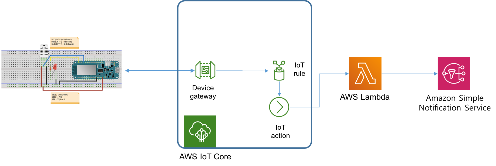

# AWS Lambda를 이용한 Device Monitoring 실습

- 이번 실습에서는 수집된 온도가 25도를 넘어갈 경우, AWS SNS를 통해 경고 이메일을 전송하는 IoT 백엔드를 AWS IoT Core, AWS Lambda, Amazon SNS 서비스를 이용하여 구축한다.

- **IoT 서비스 아키텍처**
	

### 사전준비
- [AWS IoT로 온도 값 전송 및 LED 제어](https://kwanulee.github.io/IoTPlatform/start-aws-iot.html#4) 실습을 마친 상태

### 단계1: 이메일을 위한 SNS 주제 설정
1. [Amazon SNS 시작하기](https://docs.aws.amazon.com/ko_kr/sns/latest/dg/sns-getting-started.html) 실습에서 진행한 방식대로 이메일을 위한 SNS 주제를 생성한다.
	- **주제 이름**: temerature\_warning\_topic
	- 다음 예와 같은 주제 ARN을 클립보드에 복사합니다.

		```
		arn:aws:sns:ap-northeast-2:123456789012:temerature_warning_topic
		```
2. 생성한 주제에 대한 구독을 생성합니다.
	-  앞서 복사한 주제 ARN을 입력합니다.
	-  프로토콜에서는 엔드포인트 유형을 이메일로 선택합니다.
	-  엔드포인트에 알림을 받는데 사용할 수 있는 이메일 주소를 입력합니다.

### 단계2: Lambda 함수 정의
1. AAWS Serverless App 프로젝트를 Jetbrains 용 AWS Toolkit을 이용하여 생성한다.
	- **Project name**: *MonitoringLambda*

2. build.gradle 파일을 열고 다음 의존성을 추가하고, **변경사항을 반영**합니다.

	```
	dependencies {
		 ...
		 implementation platform('com.amazonaws:aws-java-sdk-bom:1.12.529')
	    implementation 'com.amazonaws:aws-java-sdk-sns'
	    implementation 'com.google.code.gson:gson:2.9.0'
	    ...
	}
	```
	- **gson**은 google에서 만든 json 라이브러리다. 자세한 사용법은 아래 링크를 참조
		- 참고자료: https://yookeun.github.io/java/2017/05/27/java-gson/
4. **src/main/java/helloworld/App.java** 파일을 아래 코드로 대체하고, **AccessKey**, **SecretKey**, **topicArn**을 여러분의 설정 값으로 변경하세요

	```java
	package helloworld;
	
	import com.amazonaws.auth.AWSStaticCredentialsProvider;
	import com.amazonaws.auth.BasicAWSCredentials;
	import com.amazonaws.regions.Regions;
	import com.amazonaws.services.lambda.runtime.Context;
	import com.amazonaws.services.lambda.runtime.RequestHandler;
	import com.amazonaws.services.sns.AmazonSNS;
	import com.amazonaws.services.sns.AmazonSNSClientBuilder;
	import com.amazonaws.services.sns.model.PublishRequest;
	import com.amazonaws.services.sns.model.PublishResult;
	import com.google.gson.JsonElement;
	import com.google.gson.JsonParser;
	
	
	public class App implements RequestHandler<Object, String> {
	
	    public String handleRequest(Object input, Context context) {
	        context.getLogger().log("Input: " + input);
	        String json = ""+input;
	        JsonParser parser = new JsonParser();
	        JsonElement element = parser.parse(json);
	        JsonElement state = element.getAsJsonObject().get("state");
	        JsonElement reported = state.getAsJsonObject().get("reported");
	        String temperature = reported.getAsJsonObject().get("temperature").getAsString();
	        double temp = Double.valueOf(temperature);
	
	        final String AccessKey="your-accesskey";
	        final String SecretKey="your-secretkey";
	        final String topicArn="your-topicarn";
	
	        BasicAWSCredentials awsCreds = new BasicAWSCredentials(AccessKey, SecretKey);
	        AmazonSNS sns = AmazonSNSClientBuilder.standard()
	                .withRegion(Regions.AP_NORTHEAST_2)
	                .withCredentials( new AWSStaticCredentialsProvider(awsCreds) )
	                .build();
	
	        final String msg = "*Temperature Critical*\n" + "Your device temperature is " + temp + "C";
	        final String subject = "Critical Warning";
	        if (temp >= 26.0) {
	            PublishRequest publishRequest = new PublishRequest(topicArn, msg, subject);
	            PublishResult publishResponse = sns.publish(publishRequest);
	        }
	
	        return subject+ "temperature = " + temperature + "!";
	    }
	}
	
	```
4. 로컬에서 실행
	- [**필수**] Docker 프로세스가 실행된 상태이어야 함 
	-  IntelliJ IDEA IDE의 화면 상단 타이틀 바에서 "[Local] HelloWorldFunction" 옆의 **연두색 실행 버튼 (삼각형)을 클릭**
	-  [**Edit Configuration**] 다이얼로그 화면에서 **Text -- Event Templates --** 부분의 드롭다운 메뉴 중에서 *API Gateway AWS Proxy*를 선택 
	-  데이터 창에 다음 JSON 문자열을 입력하고 **Run** 클릭

		```
		{ 
			"state": 
				{
					"reported":
						{
							"temperature":26.0, "LED":"OFF"
						}
				}
		}
		```
	
	- SNS 주제에 구독중인 이메일로  "*Critical Warning*" 제목의 메시지가 도착했는지 확인한다.

5. 4번까지 정상적으로 수행되는 것이 확인되면, 배포하고, 원격에서 실행하여 동일한 결과가 나오는 지를 확인한다.

### 단계3: IoT 규칙 설정
1. AWS IoT 콘솔로 이동하여 탐색 창에서 **메시지 라우팅 > 규칙**을 선택합니다.
2. **규칙생성**을 선택하여 AWS IoT 규칙을 생성합니다.
3. **규칙속성** 페이지에서 규칙의 이름(*tempWarningRule*)을 입력하고, **다음**을 선택합니다.
4. **SQL 문 구성** 페이지에서 **SQL 문** 란에 다음 쿼리를 입력합니다.


	```
	SELECT * FROM '$aws/things/MyMKRWiFi1010/shadow/update/accepted'
	```

6. **규칙작업**의 드롭다운 메뉴(**작업 선택**)에서 **Lambda**을 선택한 다음, Lambda 함수로 *MonitoringLambda-HelloWorldFunction-XXXX*를 선택하고, **다음**을 선택합니다.
7. **검토 및 생성** 페이지에서 단계별 내용을 검토 후에 **생성**을 선택합니다.


8. **작업 추가**를 선택합니다.

### 단계4: 테스트
1. [AWS\_IoT\_DHT11](release/AWS_IoT_DHT11.zip)을 다운로드하여 Arduino IDE에서 실행한다.
2. arduino_secrets.h에서 다음 항목을 사용 환경에 맞도록 수정후, 빌드/업로드 한다.
	- SECRET\_SSID: 무선랜 아이디
	- SECRET\_PASS: 무선랜 패스워드
	- SECRET\_BROKER: AWS IoT broker 엔드포인트
	- SECRET\_CERTIFICATE: 인증서 ([2.6절](#2.6) 참조)
3.  아두이노 IDE의 시리얼 모니터를 열고, 접속이 제대로 이루어지는 지 확인해 본다.
	
4. DHT-11 센서의 측정값이 26도를 초과하는 경우에 이메일이 수신되는 지 확인한다.
